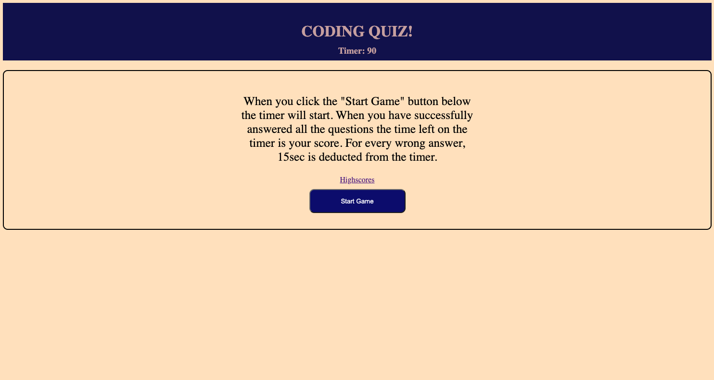

# coding-quiz

This project is menat to utilize lessons in javascript to create a game whereby you answer simple questions within a certain amount of time.

Each wrong answer 15seconds is deducted.

# Authors

Alan Mecca

# Screenshot

# Acknowledgements

Kai or Bootcamp class (whoever wrote the code for despriptive part of the class)- I utilized code from the class to help fill in the blanks on various parts of the project that were not working correctly.

w3 School - I utilized several scripts from w3 to help with various coding challenges.

